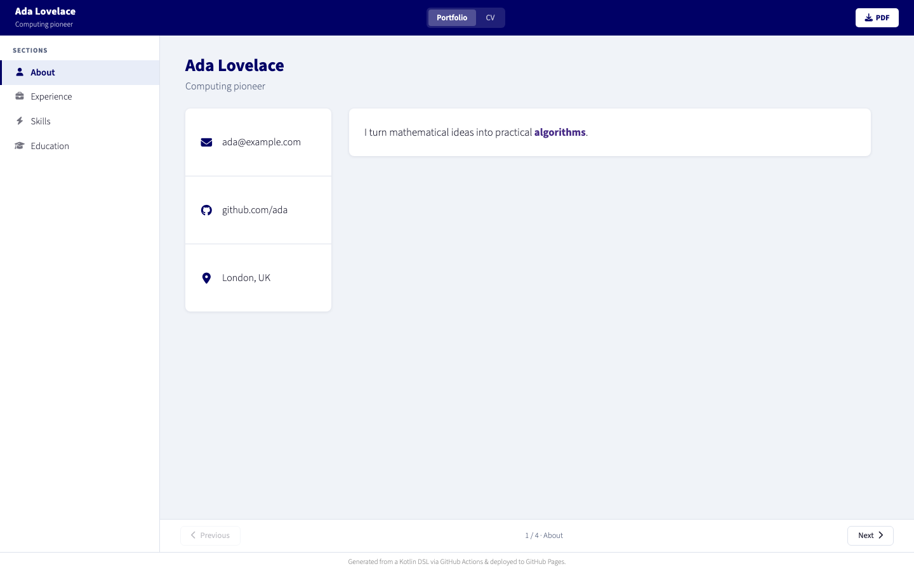

# cv-dsl

[](https://github.com/tolikttaaa/cv-dsl/actions/workflows/ci.yml)
[](https://jitpack.io/#tolikttaaa/cv-dsl)
[](LICENSE)

`cv-dsl` is a type-safe Kotlin DSL for keeping a CV in code and rendering the
same immutable model as both a static portfolio and LuaLaTeX sources. It ships
with the renderers, web assets, LaTeX class and fonts, plus a Gradle plugin that
adds generation, PDF, site-assembly and preview tasks.

## What it produces

One Kotlin definition produces:

```text
build/
├── latex/                 # cv.tex, section files, class and local fonts
├── web/                   # index.html, CSS, JavaScript and favicon
├── cv.pdf                 # compiled by the generatePdf task
└── site/                  # deployable web output plus cv.pdf
```

The [simple example](examples/simple) contains a small but complete CV. Run it
to see the generated portfolio in a browser:



```bash
./gradlew -p examples/simple generateWeb
jwebserver -d examples/simple/build/web -p 8080
```

Then open `http://localhost:8080`. The same example can generate compilable
LaTeX with `generateLatex`, or a PDF with `generatePdf` when LuaLaTeX is
installed.

## Use the library

Released tags are available through JitPack. Add the release to both the build
script classpath (for the plugin) and application dependencies (for the DSL):

```kotlin
// build.gradle.kts
buildscript {
    repositories { maven("https://jitpack.io") }
    dependencies { classpath("com.github.tolikttaaa:cv-dsl:v0.1.0") }
}

plugins {
    kotlin("jvm") version "2.2.20"
    application
}

apply(plugin = "cv.dsl.generation")

repositories {
    mavenCentral()
    maven("https://jitpack.io")
}

dependencies {
    implementation("com.github.tolikttaaa:cv-dsl:v0.1.0")
}

application {
    mainClass.set("example.MainKt")
}
```

Define a model and delegate generation to `CvApplication`:

```kotlin
package example

import cv.dsl.cv
import cv.generation.CvApplication
import cv.model.Organization

private val myCv = cv {
    firstName = "Ada"
    lastName = "Lovelace"
    tagline = "Computing pioneer"
    footerText = "Ada Lovelace — CV"

    social {
        row {
            email("ada@example.com")
            github("ada")
        }
    }

    summary("Summary", "faUser") {
        paragraph("I turn mathematical ideas into practical algorithms.") {
            bold("algorithms")
        }
    }

    experience("Experience", "faSuitcase", id = "experience") {
        work(
            role = "Mathematician",
            company = Organization("Analytical Engines"),
            location = "London",
            dates = "1842 – 1843",
            tags = listOf("Algorithms", "Mathematics"),
        ) {
            paragraph("Wrote and published the first algorithm for a machine.")
        }
    }
}

fun main(args: Array<String>) = CvApplication(myCv).run(args)
```

Now use the plugin tasks:

| Task | Result |
|---|---|
| `generateWeb` | Static portfolio in `build/web` |
| `generateLatex` | Complete LuaLaTeX source tree in `build/latex` |
| `generatePdf` | Compiled `build/cv.pdf` |
| `assembleSite` | Portfolio and PDF in `build/site` |
| `serveSite` / `stopSite` | Managed local preview on port 8080 |
| `verifyCvEnvironment` | Diagnostics for LuaLaTeX and `jwebserver` |

Plugin defaults can be overridden when needed:

```kotlin
cvGeneration {
    mainClass.set("example.MainKt")
    lualatexExecutable.set("/opt/texlive/bin/lualatex")
    previewPort.set(9090)
}
```

## Rich text

Descriptions support paragraphs, bullets and composable inline styles. Plain
text is escaped by both renderers.

```kotlin
paragraph("Kotlin makes CV content safe & readable.") {
    highlight("Kotlin", linkTo("https://kotlinlang.org"), bold)
    italic("readable")
}
bullets {
    item("A measurable achievement") { bold("measurable") }
}
```

Highlight rules must match at least once. This intentionally turns stale
formatting after a content edit into a test or generation failure.

## Requirements

- JDK 21 to build and run the Gradle plugin;
- LuaLaTeX from TeX Live or MacTeX only for PDF compilation;
- no external tool is required for web or LaTeX-source generation.

## Development

```bash
./gradlew check
./gradlew jacocoTestReport
./gradlew -p examples/simple clean generateWeb
```

`check` runs compilation, JUnit 5 tests, Detekt and the 70% repository-wide
line-coverage gate. The HTML report is written to
`build/reports/jacoco/test/html/index.html`.

See [CONTRIBUTING.md](CONTRIBUTING.md) for the required change/test workflow,
[architecture.md](docs/architecture.md) for extension points, and
[releasing.md](docs/releasing.md) for the automated release process.

## License

Code and templates are MIT licensed. Bundled Source Sans Pro fonts retain the
SIL Open Font License described in [THIRD_PARTY_NOTICES.md](THIRD_PARTY_NOTICES.md).
