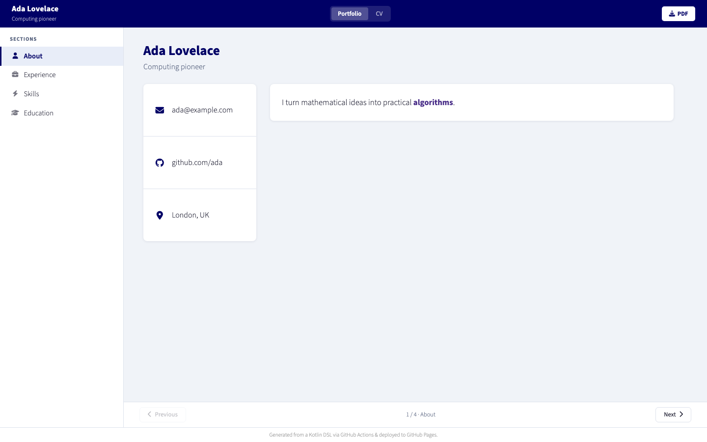

# cv-dsl

[](https://github.com/tolikttaaa/cv-dsl/actions/workflows/ci.yml)
[](https://jitpack.io/#tolikttaaa/cv-dsl)
[](LICENSE)

`cv-dsl` is a type-safe Kotlin DSL for keeping a CV in code and rendering the
same immutable model as a static portfolio, LuaLaTeX sources and a Markdown
document. It ships with the renderers, web assets, LaTeX class and fonts, plus
a Gradle plugin that adds generation, PDF, site-assembly and preview tasks.

## What it produces

One Kotlin definition produces:

```text
build/
├── latex/                 # cv.tex, section files, class and local fonts
├── web/                   # index.html, CSS, JavaScript and favicon
├── markdown/              # cv.md, a single text-first document
├── cv.pdf                 # compiled by the generatePdf task
└── site/                  # deployable web output plus cv.pdf
```

The [simple example](examples/simple) contains a small but complete CV. Run it
to see the generated portfolio in a browser:



```bash
./gradlew -p examples/simple generateWeb
jwebserver -d examples/simple/build/web -p 8080
```

Then open `http://localhost:8080`. The same example can generate compilable
LaTeX with `generateLatex`, or a PDF with `generatePdf` when LuaLaTeX is
installed.

## Use the library

Released tags are available through JitPack. Add the release to both the build
script classpath (for the plugin) and application dependencies (for the DSL):

```kotlin
// build.gradle.kts
buildscript {
    repositories { maven("https://jitpack.io") }
    dependencies { classpath("com.github.tolikttaaa:cv-dsl:v0.1.0") }
}

plugins {
    kotlin("jvm") version "2.4.10"
    application
}

apply(plugin = "cv.dsl.generation")

repositories {
    mavenCentral()
    maven("https://jitpack.io")
}

dependencies {
    implementation("com.github.tolikttaaa:cv-dsl:v0.1.0")
}

application {
    mainClass.set("example.MainKt")
}
```

Define a model and delegate generation to `CvApplication`:

```kotlin
package example

import cv.dsl.cv
import cv.generation.CvApplication
import cv.model.Organization

private val myCv = cv {
    firstName = "Ada"
    lastName = "Lovelace"
    tagline = "Computing pioneer"
    footerText = "Ada Lovelace — CV"

    social {
        row {
            email("ada@example.com")
            github("ada")
        }
    }

    summary("Summary", "faUser") {
        paragraph("I turn mathematical ideas into practical algorithms.") {
            bold("algorithms")
        }
    }

    experience("Experience", "faSuitcase", id = "experience") {
        work(
            role = "Mathematician",
            company = Organization("Analytical Engines"),
            location = "London",
            dates = "1842 – 1843",
            tags = listOf("Algorithms", "Mathematics"),
        ) {
            paragraph("Wrote and published the first algorithm for a machine.")
        }
    }
}

fun main(args: Array<String>) = CvApplication(myCv).run(args)
```

Now use the plugin tasks:

| Task | Result |
|---|---|
| `generateWeb` | Static portfolio in `build/web` |
| `generateLatex` | Complete LuaLaTeX source tree in `build/latex` |
| `generateMarkdown` | Markdown document in `build/markdown` |
| `generateCv` | Every target selected by `cvGeneration.formats` (all by default; `WEB` builds the site including the PDF) |
| `generatePdf` | Compiled `build/cv.pdf`, verified against the [PDF layout rules](#pdf-layout); `build/cv-layout.txt` lists where every element landed |
| `assembleSite` | Portfolio and PDF in `build/site` |
| `serveSite` / `stopSite` | Managed local preview on port 8080 |
| `verifyCvEnvironment` | Diagnostics for LuaLaTeX and `jwebserver` |

Plugin defaults can be overridden when needed:

```kotlin
import cv.model.RenderTarget

cvGeneration {
    mainClass.set("example.MainKt")
    lualatexExecutable.set("/opt/texlive/bin/lualatex")
    previewPort.set(9090)
    // Targets produced by the aggregate generateCv task; defaults to all of
    // them. WEB assembles the deployable site, which includes the compiled
    // PDF. Unknown values are impossible — the property is enum-typed.
    formats.set(setOf(RenderTarget.WEB, RenderTarget.MARKDOWN))
}
```

## Organizations and repositories

Positions, projects and references point to an `Organization`, whose name is
linked when it has a URL. A project that lives on GitHub, GitLab or Bitbucket
can reference its repository instead. It renders as the repository name, the
platform's name and its icon, in one style and inside one link (for example
`cv-dsl | GitHub <GitHub icon>`):

```kotlin
import cv.model.CodeHost
import cv.model.Organization

project(
    name = "Kotlin DSL for CV generation",
    company = Organization.repository(CodeHost.GITHUB, "tolikttaaa", "cv-dsl"),
    dates = "2026",
    tags = listOf("Kotlin"),
) {
    paragraph("…")
}
```

## Rich text

Descriptions support paragraphs, bullets and composable inline styles. Plain
text is escaped by both renderers.

```kotlin
paragraph("Kotlin makes CV content safe & readable.") {
    highlight("Kotlin", linkTo("https://kotlinlang.org"), bold)
    italic("readable")
}
bullets {
    item("A measurable achievement") { bold("measurable") }
}
```

Highlight rules must match at least once. This intentionally turns stale
formatting after a content edit into a test or generation failure.

## Per-element render targets

Every section, entry and contact accepts an optional `scope` controlling the
outputs it appears in. By default everything is rendered by every target; a
`RenderScope` narrows that down through its `renderers` (allow-list, defaults
to all) and `excludedRenderers` (deny-list, defaults to empty) sets:

```kotlin
import cv.model.RenderScope
import cv.model.RenderTarget

social {
    row {
        email("ada@example.com")
        phone("+44 20 0000 0000", scope = RenderScope.except(RenderTarget.WEB))
    }
}

// The whole section only appears in the PDF:
references("References", "faQuoteLeft", scope = RenderScope.only(RenderTarget.PDF)) {
    // …and single entries can be excluded from any target the section renders in.
    referee(name = "…", role = "…", company = Organization("…"), period = "…", email = "…")
}
```

An element is rendered by a target when the target is in `renderers` and not in
`excludedRenderers`. Filtering is applied once, centrally, before rendering —
individual renderers never see excluded elements.

## PDF layout

The `pdf` block sets the print settings of the PDF. The base font size scales
every other size of the document (name, headings, contacts, keyword chips);
without it the document keeps its 10pt default. `maxPages` bounds the length of
the compiled PDF:

```kotlin
pdf {
    fontSize = 9.5
    maxPages = 2
}
```

Every section and entry also accepts a `pageFit` rule for where it must land:

```kotlin
import cv.model.PageFit

experience("Experience", "faSuitcase", id = "experience", pageFit = PageFit.OnPage(1)) {
    // …the whole section, title included, must sit on page 1.
}
skills("Skills", "faCode", pageFit = PageFit.SinglePage) {
    // …never split across a page break, whichever page that is.
}
```

Rules are verified, not enforced: `generatePdf` compiles the document as usual,
then fails with every broken rule, for example

```text
PDF layout: 3 pages, 2 of 2 page rules violated:
  - The PDF has 3 pages, but is limited to 2
  - Experience must fit on page 1, but occupies pages 1–2
```

The PDF is still written so the layout can be inspected, and
`build/cv-layout.txt` lists the pages of every section and entry. Shorten the
content or lower `fontSize` until the rules hold. Rules that no layout can
satisfy, such as `OnPage(3)` with `maxPages = 2`, fail generation right away.
The web and Markdown outputs ignore the `pdf` block and page rules.

The LaTeX layout keeps every entry in one piece and each section title with its
first entry, so page breaks only fall between entries.

## Requirements

- JDK 21 to build and run the Gradle plugin;
- LuaLaTeX from TeX Live or MacTeX only for PDF compilation;
- no external tool is required for web or LaTeX-source generation.

## Development

```bash
./gradlew check
./gradlew jacocoTestReport
./gradlew -p examples/simple clean generateWeb
```

`check` runs compilation, JUnit 5 tests, Detekt and the 70% repository-wide
line-coverage gate. The HTML report is written to
`build/reports/jacoco/test/html/index.html`.

See [CONTRIBUTING.md](CONTRIBUTING.md) for the required change/test workflow,
[architecture.md](docs/architecture.md) for extension points, and
[releasing.md](docs/releasing.md) for the automated release process.

## License

Code and templates are MIT licensed. Bundled Source Sans Pro fonts retain the
SIL Open Font License described in [THIRD_PARTY_NOTICES.md](THIRD_PARTY_NOTICES.md).
